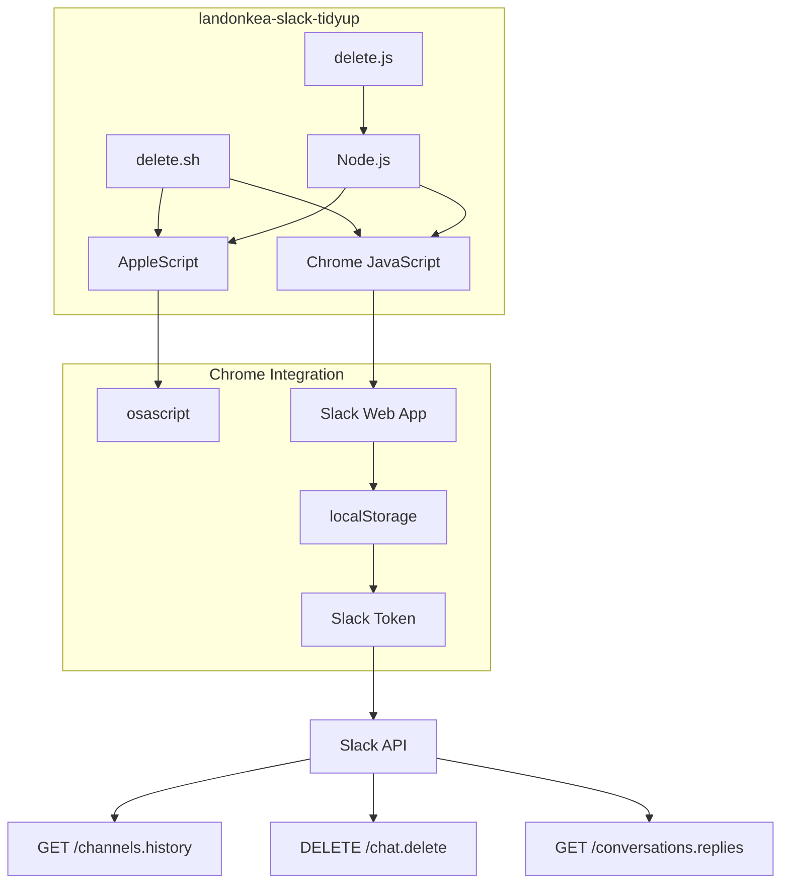
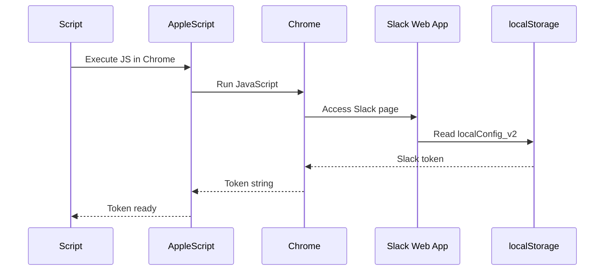
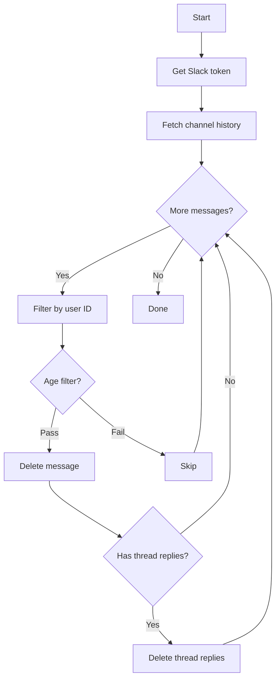

# landonkea-slack-tidyup — Design & Workflow

## High-Level Overview

## Token Extraction Flow

## Message Deletion Flow

## File Relationships

| File | Purpose | Dependencies |
|------|---------|--------------|
| `delete.sh` | Bash + AppleScript version | macOS, Chrome |
| `delete.js` | Node.js version | macOS, Chrome, Node.js |
| `.env` | User ID config | `delete.sh`, `delete.js` |
| `.env.example` | Template | User setup |

## draw.io

[Open in draw.io](https://app.diagrams.net/#RSlack%20message%20deletion%20flow)
